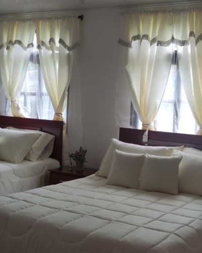

<header class="header_landing">
    

        <h1>Vive el Sueño de San Agustín: Casa-Hotel con Potencial Turístico a 5 Minutos del Pueblo</h1>
        
Propiedad versátil de 2 pisos con 5 habitaciones (todas con baño privado) - Perfecta para hotel boutique, Airbnb o vivienda familiar

        <a href="tel:3218301698" class="boton boton_1">Llamar ahora para más información</a>
    

</header>

<section class="cta">
    

        

            <h2>La Historia Detrás de Esta Propiedad Única</h2>
            
"Después de 18 emprendimientos exitosos y más de cinco años invirtiendo en San Agustín, mi padre identificó esta ubicación privilegiada para crear algo especial: una propiedad que combina el encanto turístico con el potencial de inversión."

            
Hoy, con nuevos proyectos en el horizonte, esta joya arquitectónica busca su próximo visionario.

            <a href="#detalles" class="boton boton_2">Ver detalles completos</a>
        

        <!-- Aquí iría la imagen principal de la propiedad -->
    

</section>
<section class="content flow">
    <h2>Una Inversión Inteligente en el Corazón del Turismo Huilense</h2>
    

        
        <h3>Diseñada para Múltiples Oportunidades de Ingreso</h3>
        
✓ 2 unidades independientes totalmente equipadas

        
✓ 5 habitaciones con baños privados

        
✓ Perfecta para Airbnb, hotel boutique o vivienda familiar

        
✓ Amplios espacios para jardines y parqueadero

        <a href="tel:3218301698" class="boton boton_1">¿Preguntas? Llama ahora</a>
    

    

        <h3>¿Por qué Esta Propiedad es Única?</h3>
        

            

                <button aria-expanded="false">
                    Ubicación Estratégica
                    
                </button>
                

                    
A solo 5 minutos en vehículo del centro de San Agustín, combina la tranquilidad del campo con la cercanía a todas las atracciones turísticas. Perfecta para quienes buscan paz sin sacrificar conectividad.

                

            

            

                <button aria-expanded="false">
                    Tecnología y Comodidad
                    
                </button>
                

                    
Disfruta de internet por fibra óptica, sistema de videovigilancia y tanque de reserva de agua. Todo el confort moderno en un entorno natural.

                

            

            

                <button aria-expanded="false">
                    Costos Operativos Reducidos
                    
                </button>
                

                    
Por su ubicación en vereda, los servicios públicos son significativamente más económicos que en el centro, maximizando tu retorno de inversión.

                

            

        

    

    

        

            

                <h3>Oportunidad de Inversión Limitada</h3>
                
Valor: $550,000,000 COP

                
Ideal para emprendedores visionarios que buscan establecerse en uno de los destinos turísticos más prometedores de Colombia

                <a href="tel:3218301698" class="boton boton_1">Agenda tu visita hoy</a>
            

        

    

</section>
<section class="content flow">
    <h2>Descubre Cada Detalle de Tu Futura Inversión</h2>
    

        

            

                
                Vistas impresionantes al paisaje montañoso
            

            

                
                Espacios interiores amplios y bien iluminados
            

            

                
                Terrazas con jardines y ambiente natural
            

            

                
                Habitaciones confortables y bien equipadas
            

        

    

    

        <h3>Preguntas Frecuentes</h3>
        

            

                <button aria-expanded="false">
                    ¿Qué potencial de retorno tiene como inversión hotelera?
                    
                </button>
                

                    
San Agustín es uno de los destinos turísticos más visitados del Huila. Con 5 habitaciones y baños independientes, la propiedad está lista para operar como hotel boutique o Airbnb, con tarifas promedio en la zona entre $150,000 y $250,000 por noche.

                

            

            

                <button aria-expanded="false">
                    ¿Qué servicios y amenidades incluye?
                    
                </button>
                

                    
La propiedad cuenta con: Internet fibra óptica, sistema de videovigilancia, tanque de reserva de agua, amplios jardines, zona de parqueo, y servicios públicos económicos por ubicación en vereda.

                

            

            

                <button aria-expanded="false">
                    ¿Cuál es la distribución exacta?
                    
                </button>
                

                    
Son dos unidades independientes: piso superior con 3 habitaciones con baño privado, y piso inferior con 2 habitaciones con baño privado. Cada nivel funciona como una casa independiente, perfecta para múltiples configuraciones de negocio.

                

            

        

    

    

        

            

                <h3>¿Listo para Conocer Tu Nueva Inversión?</h3>
                
No pierdas la oportunidad de ser parte del crecimiento turístico de San Agustín

                <a href="tel:3218301698" class="boton boton_1">Agenda tu visita ahora</a>
            

        

    

</section>

